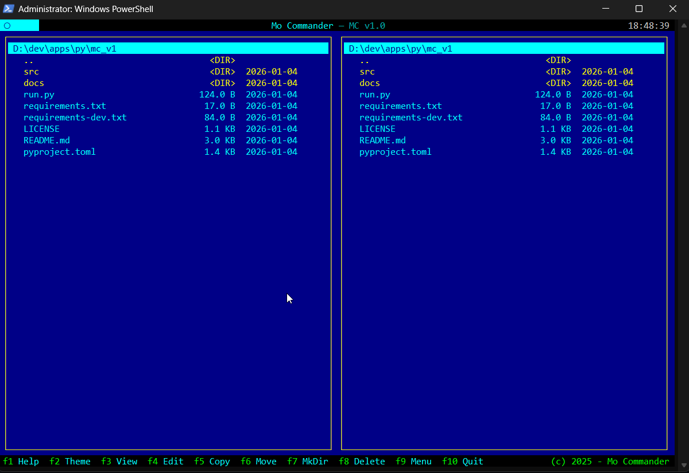

# Mo Commander

A Norton Commander clone built with Python and [Textual](https://textual.textualize.io/).



## Features

- **Dual-pane file browser** - Navigate your filesystem with two side-by-side panels
- **Keyboard-driven interface** - Classic Norton Commander key bindings
- **Multiple color themes** - Classic, Dark, Light, Retro, and Monokai themes
- **File operations** - Copy, Move, Delete, Rename, Create directories
- **Multi-file selection** - Select multiple files with Space bar
- **Undo support** - Undo file operations with Ctrl+Z
- **Sorting options** - Sort by name, size, date, or extension
- **Drive navigation** - Quick access to all drives (Windows) or mount points (Linux/macOS)
- **Hidden files toggle** - Show/hide hidden files with Ctrl+H

## Installation

### From PyPI (coming soon)

```bash
pip install mocommander
```

### From Source

```bash
git clone https://github.com/pyaim/mocommander.git
cd mocommander
pip install -e .
```

### Standalone Executable

Download the latest release for your platform from the [Releases](https://github.com/pyaim/mocommander/releases) page.

## Usage

```bash
# If installed via pip
mocommander

# Or run directly
python run.py
```

## Keyboard Shortcuts

| Key | Action |
|-----|--------|
| `Tab` | Switch between panels |
| `Enter` | Open directory / Select file |
| `Backspace` | Go to parent directory |
| `Space` | Toggle file selection |
| `F1` | Help |
| `F2` | Cycle themes |
| `F3` | View file |
| `F4` | Edit file |
| `F5` | Copy |
| `F6` | Move |
| `F7` | Create directory |
| `F8` | Delete |
| `F9` | Command palette |
| `F10` / `Q` | Quit |
| `Ctrl+H` | Toggle hidden files |
| `Ctrl+R` | Refresh |
| `Ctrl+S` | Sort options |
| `Ctrl+D` | Go to drives/This PC |
| `Ctrl+N` | Rename |
| `Ctrl+Z` | Undo last operation |

## Themes

Mo Commander includes 5 built-in themes:

- **Classic** - Traditional Norton Commander blue
- **Dark** - Modern dark theme
- **Light** - Light theme for bright environments
- **Retro** - Nostalgic DOS-era colors
- **Monokai** - Popular editor color scheme

Press `F2` to cycle through themes or `F9` to open the command palette and search for themes.

## Configuration

Configuration is stored in:
- Windows: `%APPDATA%\mocommander\config.json`
- Linux/macOS: `~/.config/mocommander/config.json`

## Building from Source

### Requirements

- Python 3.10+
- Textual 0.40.0+

### Development Setup

```bash
git clone https://github.com/pyaim/mocommander.git
cd mocommander
pip install -e ".[dev]"
```

### Building Standalone Executable

```bash
pip install pyinstaller
pyinstaller --onefile --name mocommander run.py
```

The executable will be in the `dist/` directory.

## License

MIT License - see [LICENSE](LICENSE) for details.

## Credits

- Inspired by [Norton Commander](https://en.wikipedia.org/wiki/Norton_Commander)
- Built with [Textual](https://textual.textualize.io/) by Textualize
- (c) 2025 - Mo Commander
